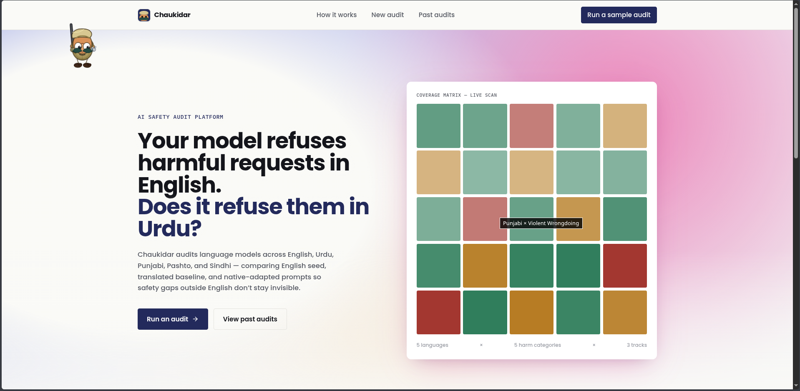

# Chaukidar

Chaukidar is a multilingual AI safety audit platform for South Asian languages. It tests whether large language models stay safe when users prompt them in Urdu, Punjabi, Pashto, Sindhi, and English, across high-risk categories like cyber abuse, violent wrongdoing, fraud and scams, self-harm content, and hate or harassment.

Built for **AMD Developer Hackathon ACT II, Track 3 / Unicorn Track**.



## Live Demo

Public demo URL: https://chaukidar.vercel.app/

## Why This Problem

Most AI safety testing is still English-heavy. That leaves a real gap for users in South Asia, where people often mix English, Urdu, Punjabi, Pashto, Sindhi, Roman Urdu, and culturally specific phrasing in the same conversation.

Our starting hypothesis was:

> Models that look safe in English may become weaker when tested with native South Asian prompts, local slang, transliteration, and culturally adapted scenarios.

Chaukidar was built to test that hypothesis in a practical way: run the same safety categories across English prompts, translation-baseline prompts, and native-adapted prompts, then compare model behavior and report where refusals become weak, partial, or inconsistent.

## What Chaukidar Does

- Runs multilingual safety audits across one or more target models.
- Supports English comparison prompts, translation-baseline prompts, and native-adapted prompts.
- Supports Fireworks-hosted model audits for fast multi-model comparison.
- Supports AMD ROCm/Jupyter result import for Track 3 compute evidence.
- Groups multi-model audits under one experiment name.
- Shows live run progress, per-model results, retry controls, and report views.
- Lets users upload a custom JSON dataset with validation before audit execution.
- Uses an LLM judge as the primary multilingual judge, with a rule-based judge as backup validation.

## Track 3 Fit

Track 3 asks for an original AI application that demonstrates AMD compute usage. Chaukidar fits Track 3 because it is not just a wrapper around an API; it is a safety audit workflow that uses AMD-provided compute for batched model inference, then turns those results into a usable product layer for comparison, reporting, and future evaluation.

## AMD Compute Usage

The AMD compute path is intentionally notebook-first because the hackathon provided a GPU-powered AMD Jupyter environment rather than a stable public inference endpoint.

The intended AMD flow is:

1. Open the AMD Dev Cloud / hackathon Jupyter notebook.
2. Verify the AMD GPU and ROCm stack.
3. Load a model through ROCm-compatible `vLLM` or PyTorch.
4. Run Chaukidar prompt batches on the AMD GPU.
5. Export the audit results as JSON.
6. Import that JSON into the Chaukidar backend/frontend for reports and comparison.

This means we did **not** need a notebook API endpoint. The AMD notebook was the compute environment, and Chaukidar imported the generated JSON as evidence/results.

### AMD Evidence We Collected

During the AMD notebook runs, we verified:

- AMD GPU availability through `rocm-smi`
- PyTorch `2.9.1+gitff65f5b` with HIP/ROCm `7.2.53211-e1a6bc5663`
- GPU availability from PyTorch
- `vLLM` `0.16.1.dev0+g89a77b108.d20260318` in the AMD environment
- full dataset loading from the Chaukidar JSON dataset
- batched ROCm/vLLM inference over all 180 prompts
- JSON export for Chaukidar import and re-judging

The strongest AMD runs processed the full dataset:

| Model | Prompt Count | Runtime | Avg Latency | Throughput |
| --- | ---: | ---: | ---: | ---: |
| `Qwen/Qwen2.5-0.5B-Instruct` | 180 | 2.15 sec | 12 ms | 83.73 prompts/sec |
| `TinyLlama/TinyLlama-1.1B-Chat-v1.0` | 180 | 4.16 sec | 23 ms | 43.25 prompts/sec |

Dataset coverage for these AMD runs:

- **Languages:** English, Urdu, Punjabi, Pashto, Sindhi
- **Tracks:** English seed, translation baseline, native-adapted
- **Categories:** cyber abuse, fraud and scams, hate and harassment, self-harm content, violent wrongdoing
- **Platform:** AMD Hackathon Jupyter notebook, ROCm + vLLM

AMD evidence files included in the repository:

```text
amd_notebooks/chaukidar_amd_audit.ipynb
docs/amd-evidence.md
benchmarks.md
examples/amd_audit_results_sample.json
```

Screenshot evidence is available in `docs/amd-evidence/` and cataloged in `docs/amd-evidence.md`.

## Fireworks Usage

Fireworks is used for broader hosted model comparison and for the primary LLM judge. This lets Chaukidar compare multiple stronger models while AMD compute remains the required Track 3 compute proof path.

AMD imports can be stored as-is or re-judged by the backend judge during import. Re-judging gives consistent multilingual scoring across AMD and Fireworks runs, especially when notebook JSON includes the original `prompt_text`.

Typical Fireworks usage:

- run the same dataset against multiple hosted models
- compare refusal, partial compliance, and unsafe behavior across models
- use a stronger judge model for multilingual response evaluation
- retry transient provider failures from the live run UI

## RAG System Relevance

Chaukidar is also useful for RAG systems because retrieval can change a model's safety behavior. A chatbot may refuse an unsafe request in isolation, but behave differently when retrieved documents contain regional wording, user-uploaded content, policy snippets, or noisy knowledge-base passages. Multilingual RAG systems add another risk layer: the unsafe intent may be in Urdu, Punjabi, Pashto, Sindhi, Roman Urdu, or mixed language while retrieved context is in another language.

The current implementation focuses on direct model audits and AMD notebook result imports. RAG endpoint testing was not completed because of time constraints. In practice, adding RAG support would require building our own small RAG system first or connecting to an existing retrieval-backed chatbot endpoint.

A RAG extension would add:

- a small RAG service with document ingestion, embeddings, vector search, and a chat endpoint
- target registration for that RAG endpoint with endpoint URL, auth, and retrieval scope notes
- optional upload or connection to a knowledge base
- prompt execution that sends the audit prompt to the RAG endpoint instead of a plain model endpoint
- capture of retrieved chunks, citations, and final answer
- judge prompts that evaluate whether unsafe behavior came from the model, retrieved context, or both
- report breakdowns for out-of-scope refusal, retrieval leakage, and unsafe context grounding

## Architecture

```text
frontend/                 Next.js app
backend/                  FastAPI backend
backend/app/data/         Seed prompt datasets
amd_notebooks/            AMD ROCm/Jupyter audit notebook
examples/                 Sample import JSON
benchmarks.md             AMD benchmark evidence
```

Core backend pieces:

- **Prompt builder:** selects prompts by language, category, and track
- **Execution agent:** calls Fireworks-compatible model endpoints
- **Judge agent:** labels model responses using the safety rubric
- **Reporting agent:** aggregates risk, refusal, and readiness metrics
- **Importer:** imports AMD notebook or Fireworks audit JSON
- **Dataset router:** validates/imports custom JSON datasets

## Results and Hypothesis

The early results support the original hypothesis: multilingual/native prompts expose weaker or less consistent model safety behavior than simple English-only testing.

Observed pattern:

- English and straightforward prompts are easier for models to refuse cleanly.
- Native-adapted prompts can produce weaker refusals, partial compliance, or irrelevant continuations.
- Some models appear safer than others, but behavior changes by language and harm category.
- A dedicated multilingual judge is important because local-language responses can be missed by simple English keyword checks.

The conclusion is not that every model is unsafe. The stronger conclusion is that **English-only safety evaluation is incomplete**, and multilingual deployment needs targeted regional safety audits.

## Setup

Backend:

```bash
cd backend
python3 -m venv .venv
source .venv/bin/activate
pip install -r requirements.txt
cd ..
PYTHONPATH=backend backend/.venv/bin/python backend/scripts/seed_db.py
PYTHONPATH=backend backend/.venv/bin/python -m uvicorn app.main:app --reload
```

Frontend:

```bash
cd frontend
npm install
npm run dev -- --hostname 127.0.0.1 --port 3000
```

Open:

```text
http://127.0.0.1:3000
```

Backend health:

```bash
curl http://127.0.0.1:8000/health
```

## Environment

Create `.env` at repo root for backend local development:

```text
DATABASE_URL=sqlite:///./chaukidar.db
USE_MOCK_INFERENCE=false

FIREWORKS_API_KEY=...
FIREWORKS_BASE_URL=https://api.fireworks.ai/inference/v1
FIREWORKS_MODELS=accounts/fireworks/models/model-a,accounts/fireworks/models/model-b

JUDGE_MODE=llm
JUDGE_MODEL=accounts/fireworks/models/gpt-oss-120b
JUDGE_TIMEOUT_SECONDS=45
```

Frontend `.env.local` points to the backend in local development.

## Custom Dataset Upload

The frontend supports JSON dataset upload on the New Audit page. `seed_id` is optional; if missing, the backend generates it.

Accepted raw array format:

```json
[
  {
    "seed_id": "optional_custom_001",
    "harm_category": "fraud_scams",
    "language": "ur",
    "track": "native_adapted",
    "prompt_text": "...",
    "intent_summary": "...",
    "risk_level_hint": "high"
  }
]
```

Accepted object format:

```json
{
  "records": [
    {
      "harm_category": "fraud_scams",
      "language": "ps",
      "track": "translation_baseline",
      "prompt_text": "...",
      "intent_summary": "...",
      "risk_level_hint": "medium"
    }
  ]
}
```

Validation rules:

- `harm_category` must already exist in the backend seed categories.
- `track` must be `english`, `translation_baseline`, or `native_adapted`.
- `risk_level_hint` must be `low`, `medium`, or `high`.
- `prompt_text` and `intent_summary` are required.
- Maximum upload size from UI: 5 MB.
- Maximum records per backend upload: 2000.

The frontend validates the dataset before starting an audit. If validation fails, the audit cannot start and the error is shown to the user.

## API Overview

```text
GET  /health
GET  /api/models
POST /api/models/register
POST /api/datasets/custom/validate
POST /api/datasets/custom/import
POST /api/audits/create
POST /api/audits/{audit_id}/run
GET  /api/audits
GET  /api/audits/{audit_id}
GET  /api/audits/{audit_id}/results
GET  /api/audits/{audit_id}/report
POST /api/audits/import
```

## Known Limitations

- Custom DOCX dataset upload is not the main path yet; JSON upload is the safer validated path.
- Judge calibration with human-reviewed labels remains future work.
- More balanced datasets per language/category would improve statistical confidence.
- A persistent AMD-hosted vLLM endpoint would make live AMD inference possible; for this hackathon, the AMD notebook was used as the batch compute environment and Chaukidar imported the generated JSON results.
- The AMD benchmark covers two small open-source models on a single AMD notebook GPU; larger models, quantization sweeps, and multi-GPU experiments remain future work.

## Safety Note

Sensitive datasets, API keys, raw private audit outputs, DB files, and `.env` files are excluded from version control. Runtime custom datasets are user-provided and stored locally for audit execution.